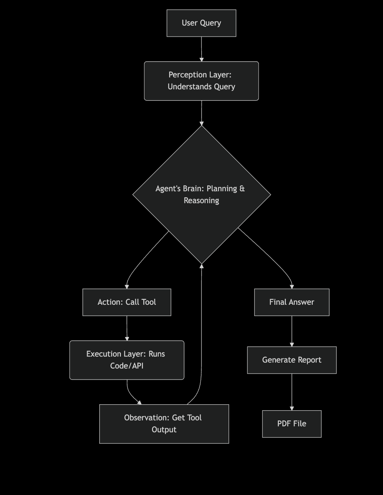

# 🕵️ Market Research Agent

Hey there! Welcome to my Market Research Agent project.

This little AI is designed to help you quickly get up-to-date information on stock and crypto prices, and even get a feel for the market sentiment. It's built to be a simple, conversational tool that can handle a few different tasks for you, all in one go.

## Technical Architecture

### LangGraph Framework

This agent is built using **LangGraph**, a powerful framework for creating stateful, multi-agent applications. LangGraph provides:

- **State Management**: Maintains context and memory throughout the conversation
- **Workflow Orchestration**: Coordinates between different tools and reasoning steps
- **Cycle Management**: Handles the iterative thought-action-observation cycle
- **Error Handling**: Manages tool failures and retries gracefully

### ReAct Agent Pattern

The agent implements the **ReAct (Reasoning + Acting)** pattern, which enables:

#### How the ReAct Agent Works

1. **Reasoning Phase**
   - The agent analyzes the user query to understand intent
   - Breaks down complex questions into manageable steps
   - Determines which tools are needed and in what sequence

2. **Acting Phase**
   - Executes the appropriate tools with extracted parameters
   - Calls external APIs and services
   - Gathers real-time data from multiple sources

3. **Observation Phase**
   - Processes tool outputs and observations
   - Evaluates if additional steps are needed
   - Synthesizes information from multiple sources

#### Agent State Flow

```python
# Simplified state representation
agent_state = {
    "messages": [],           # Conversation history
    "current_thought": "",    # Current reasoning step
    "next_action": "",        # Planned tool execution
    "observations": [],       # Tool results and data
    "final_answer": ""        # Compiled response
} 
```
## Tool Integration
The agent leverages LangGraph's tool calling capabilities:

Dynamic Tool Selection: Automatically chooses relevant tools based on context

Parameter Extraction: Intelligently extracts required parameters from natural language

Error Recovery: Handles API failures and missing data gracefully

Parallel Execution: Can execute multiple non-dependent tools concurrently

## Memory and Context
Conversation Memory: Maintains context across multiple turns

Tool History: Remembers previous tool calls and results

State Persistence: Maintains agent state throughout the execution cycle

## What it does

This agent is like your own personal market analyst. Just ask it a question in plain English, and it will go out, find the data, and give you a clear answer. For example, you can ask things like:

- "what is the price of apple stock?"
- "what is the price of bitcoin?"
- "what is the price of apple stock and bitcoin, and can you check the sentiment of both?"

It's smart enough to figure out which tools it needs to use and even extract the correct ticker symbols (like AAPL for Apple) from your query. At the end, it can even generate a simple PDF report for you.

## How it works

This project is a single-agent system. It uses a language model as its "brain" to understand your request and decide what to do. It follows a classic sense-plan-act cycle. The core workflow is:

1. **Perception**: The agent receives your text query.
2. **Cognition**: It thinks about the best way to get the information. This involves a series of "Thought" steps.
3. **Action**: It calls a specialized tool to do something, like fetching a stock price from yfinance or checking market sentiment using a search tool.
4. **Learning Loop**: It takes the tool's result (the "Observation") and uses it to decide on the next step until it can give you a final answer.

All of this is orchestrated using the powerful langgraph framework.

## Getting Started

If you want to run this agent yourself, here's how you can get it up and running on your machine:

### Clone the repository:
```bash
git clone [your-repo-url]
cd market_research_agent
```
## Set up your environment:

1. Create a virtual environment to keep things clean.
2. Install the necessary Python packages: `pip install -r requirements.txt`.

## Configure your API keys:

1. Create a `.env` file in the project's root directory.
2. Add your API keys inside, like this:
```
GEMINI_API_KEY="your-gemini-key-here"
TAVILY_API_KEY="your-tavily-key-here"
```

**Remember**: Don't share this file with anyone! It's safely ignored by Git.

## Run the agent:

```bash
python main.py
```
## The Agent's Architecture:


## The Working Mechanism:
The Model's Understanding of Financial Concepts
The language model, gemini-2.5-flash, has been trained on a massive dataset that includes a vast amount of financial information. This training data allows it to understand that "Apple" is a major company and that it is associated with a specific financial instrument called a "stock". Similarly, it knows that "Bitcoin" is a cryptocurrency.

The Model's Ability to Perform Named Entity Recognition (NER)
NER is the task of identifying and classifying named entities in text. In this case, it recognizes "Apple" as an organization and "Bitcoin" as a financial entity.

The **create_react_agent** Mechanism
The **create_react_agent** is specifically designed to handle this type of task. It acts as an orchestrator, allowing the language model to:

Analyze the user's intent: The model determines that the user's intent is to get a price.

Select the appropriate tool: Based on its understanding and the tool's description from the @tool decorator, it selects the get_stock_price and get_crypto_price tools.

Extract arguments: The model extracts the necessary arguments (ticker: AAPL, symbol: BTC-USD) from the user's query and provides them in a structured format that your tools can accept.

In short, the ticker symbol is coming from the language model's inherent ability to understand financial terms and its structured reasoning process, guided by the agent's prompt and tool definitions, to extract the correct arguments for your tools.

Example:
Ask a question: what is the price of apple stock and bitcoin?

**Thought**: The user is asking for the price of "Apple stock" and "Bitcoin." I know that my tools require ticker symbols. I have learned from my training data that "Apple" corresponds to the AAPL ticker and "Bitcoin" corresponds to the BTC-USD ticker.

**Action**: Call the get_stock_price tool with the AAPL ticker.

**Action**: Call the get_crypto_price tool with the BTC-USD ticker.
